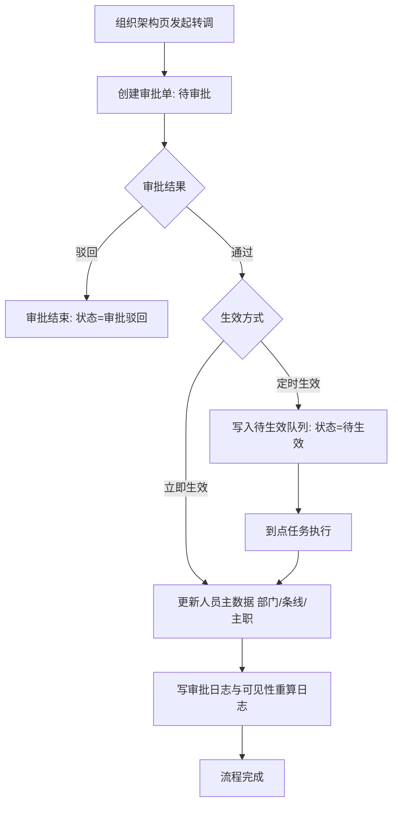
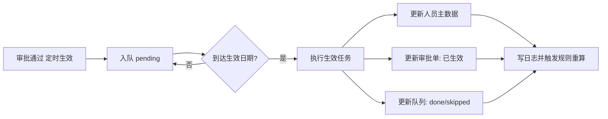
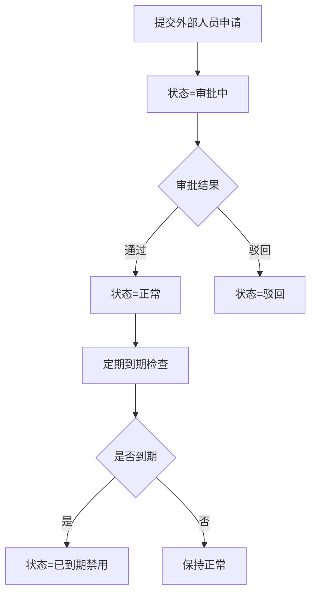
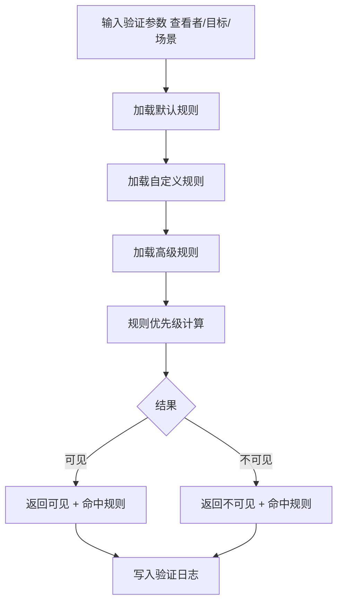

# 政务通讯录管理后台需求文档（PRD）

## 1. 新手导读

### 1.1 产品一句话
`gov-contacts-demo` 是一个面向政务组织管理场景的通讯录与组织协同后台，覆盖组织架构、人员任职、审批流、条线管理、可见性规则与展示配置。

### 1.2 为什么做
- 政务组织层级深、跨部门协作频繁，传统通讯录无法承载“行政区划+条线+任职”复杂关系。
- “谁可以看谁、看哪些字段”的规则复杂，缺少统一配置与验证能力。
- 人员转调、外部协作接入等高频变更场景需要流程化与可追踪。

### 1.3 核心价值
- **统一治理**：组织、人员、条线、权限规则在同一平台管理。
- **流程闭环**：转调审批 -> 生效执行 -> 数据同步 -> 规则重算。
- **可控可验**：规则配置可验证、关键动作可追踪、结果可验收。

### 1.4 阅读建议
- 首次阅读：先看第 2、3、4 章建立整体认知。
- 研发测试：重点看第 5、6、7、8、9、10 章。
- 运营复盘：重点看第 13 章埋点方案与指标口径。

---

## 2. 文档概述

### 2.1 需求概述
#### 2.1.1 需求背景
- 政务组织天然具备多层级、多条线、跨单位协作等复杂特征，传统通讯录产品难以同时承载组织关系、任职关系和权限关系。
- 人员转调、外部人员接入、临时专班等场景变化频繁，若缺少流程与规则支撑，容易出现数据不一致、权限越界、协同效率低等问题。
- 当前项目需要形成可演示、可扩展、可落地的政务通讯录治理样板，为后续真实后端接入和行业化复制打基础。

#### 2.1.2 需求价值
- **管理价值**：统一组织、人员、条线、规则配置入口，降低治理复杂度。
- **业务价值**：建立“发起-审批-生效-重算”闭环流程，减少人工干预和流程断点。
- **产品价值**：沉淀政务场景标准能力模型，支持后续跨项目快速复制。

### 2.2 文档目标
明确当前版本需求边界、功能设计、交互规则、异常策略、验收标准和数据追踪方案，确保产品、设计、研发、测试、运营对交付标准一致。

### 2.3 适用范围
- 前端后台系统：Vue3 + Element Plus + Vue Router。
- 数据层：Mock Provider（本地存储），预留 Real Provider 结构。
- 范围覆盖：组织/人员、审批中心、外部人员、条线/区划、可见性、展示配置、自定义字段。

### 2.4 涉及客户端类型
- 管理后台 Web 端（当前已实现并作为主交付载体）。
- Android 客户端（后续用于通讯录查看、名片展示、消息协同等场景）。
- iOS 客户端（后续用于通讯录查看、名片展示、消息协同等场景）。
- Harmony 客户端（后续用于政务终端国产化适配场景）。
- 其他端形态（小程序/桌面端）本期不纳入实现范围，但数据结构需保持可扩展。

### 2.5 目标读者
- 产品经理、设计师、前端/后端工程师、测试工程师、项目实施与运营人员。

### 2.6 版本信息
- 文档版本：V1.0（产品总监增强版）
- 项目版本：`gov-contacts-demo` 当前主分支
- 日期：2026-04-23

### 2.7 术语定义
- **主职/兼职/挂职/借调**：人员在不同组织下的任职关系类型。
- **条线**：跨组织的业务管理维度（如教育、公安、政协）。
- **可见性规则**：控制“查看、搜索、私聊”等场景中的可见权限规则。
- **临时组织/专班**：具有生效周期的组织实体，需到期提醒。

---

## 3. 产品目标与用户

### 3.1 业务目标
- 构建政务通讯录管理底座，形成可复用的组织治理能力。
- 打通“信息维护-审批变更-权限重算”的闭环链路。
- 支持外部协作与临时组织，提升复杂协同场景承载能力。

### 3.2 用户目标
- 管理员可低成本完成组织信息治理与变更控制。
- 普通用户可基于权限稳定查看准确联系人信息。
- 审批角色可高效处理变更流程，减少线下沟通成本。

### 3.3 角色分层
- `platform_admin`：平台级全局管理权限。
- `org_admin`：组织级管理权限。
- `user`：基础查看权限（无法执行管理动作）。

### 3.4 版本范围
- **In Scope**
  - 组织、人员、任职、秘书关系管理。
  - 转调审批与定时生效。
  - 外部人员审批与到期检查。
  - 条线/行政区划节点管理。
  - 可见性配置与验证、展示配置、自定义字段配置。
- **Out of Scope**
  - 真实后端接口与鉴权系统。
  - 生产级日志中心、监控平台集成。
  - 大规模数据性能优化专项。

---

## 4. 功能模块总览

### 4.1 功能点统计口径（用于评估工作量）
- 一个可独立实现、可独立测试、可独立验收的动作记为 1 个功能点。
- 标准 CRUD 口径：**新增=1、删除=1、编辑=1、查询=1**，合计 4 个功能点。
- 批量能力与单条能力分开计点（如“批量删除”与“单条删除”分别计点）。
- 配置能力与执行能力分开计点（如“流程配置保存”与“执行到点生效”分别计点）。

### 4.2 模块功能点清单（详细）

> 说明：首页 `ProjectHome` 仅用于汇报展示，不纳入功能点统计与排期评估。

#### 4.2.1 组织架构与人员管理（32 点）
| 功能点 | 类型 | 优先级 | 计点 |
|---|---|---|---|
| 组织树查询/搜索 | 查询 | P0 | 1 |
| 组织节点新增 | 新增 | P0 | 1 |
| 组织节点编辑 | 编辑 | P0 | 1 |
| 组织节点删除 | 删除 | P0 | 1 |
| 组织节点拖拽排序 | 配置 | P0 | 1 |
| 成员列表查询 | 查询 | P0 | 1 |
| 成员筛选（成员范围/状态） | 查询 | P0 | 1 |
| 成员分页切换 | 查询 | P0 | 1 |
| 人员新增 | 新增 | P0 | 1 |
| 人员详情查询 | 查询 | P0 | 1 |
| 人员编辑 | 编辑 | P0 | 1 |
| 人员删除（单条） | 删除 | P0 | 1 |
| 人员批量删除 | 删除 | P0 | 1 |
| 人员导入 | 新增 | P0 | 1 |
| 人员导入预检 | 校验 | P0 | 1 |
| 人员导入错误明细下载 | 查询 | P2 | 1 |
| 人员导出 | 查询 | P0 | 1 |
| 人员导出任务查询与下载 | 查询 | P2 | 1 |
| 转调申请发起 | 流程 | P2 | 1 |
| 转调草稿恢复 | 流程 | P2 | 1 |
| 调整部门 | 编辑 | P2 | 1 |
| 成员排序 | 编辑 | P2 | 1 |
| 重置密码 | 编辑 | P0 | 1 |
| 人员禁用 | 编辑 | P0 | 1 |
| 部门编辑抽屉保存 | 编辑 | P1 | 1 |
| 行政区划选择器查询与确认 | 查询 | P0 | 1 |
| 条线选择器查询与确认 | 查询 | P0 | 1 |
| 任职信息新增 | 新增 | P0 | 1 |
| 任职信息编辑 | 编辑 | P0 | 1 |
| 任职信息删除 | 删除 | P2 | 1 |
| 秘书关系新增/编辑 | 新增/编辑 | P1 | 1 |
| 秘书关系删除 | 删除 | P1 | 1 |

#### 4.2.2 审批中心（12 点）
| 功能点 | 类型 | 优先级 | 计点 |
|---|---|---|---|
| 审批单列表查询 | 查询 | P2 | 1 |
| 审批通过 | 流程 | P2 | 1 |
| 审批驳回 | 流程 | P2 | 1 |
| 审批意见记录 | 流程 | P2 | 1 |
| 流程配置查询 | 查询 | P1 | 1 |
| 流程节点新增 | 新增 | P1 | 1 |
| 流程节点删除 | 删除 | P1 | 1 |
| 流程节点排序调整 | 编辑 | P1 | 1 |
| 流程配置保存 | 编辑 | P1 | 1 |
| 配置版本记录查询 | 查询 | P2 | 1 |
| 待生效队列查询 | 查询 | P2 | 1 |
| 到点生效执行 | 流程 | P2 | 1 |

#### 4.2.3 外部人员管理（8 点）
| 功能点 | 类型 | 优先级 | 计点 |
|---|---|---|---|
| 外部组织查询 | 查询 | P1 | 1 |
| 外部人员列表查询 | 查询 | P1 | 1 |
| 外部人员申请新增 | 新增 | P1 | 1 |
| 外部人员申请编辑（复用表单） | 编辑 | P2 | 1 |
| 外部人员审批通过 | 流程 | P1 | 1 |
| 外部人员审批驳回 | 流程 | P1 | 1 |
| 外部人员到期检查执行 | 流程 | P1 | 1 |
| 外部人员状态变更记录 | 查询 | P2 | 1 |

#### 4.2.4 临时组织提醒（4 点）
| 功能点 | 类型 | 优先级 | 计点 |
|---|---|---|---|
| 临时组织列表查询 | 查询 | P1 | 1 |
| 到期提醒计算 | 流程 | P1 | 1 |
| 提醒状态刷新 | 编辑 | P1 | 1 |
| 提醒结果展示 | 查询 | P1 | 1 |

#### 4.2.5 条线通讯录与区划/编码管理（20 点）
| 功能点 | 类型 | 优先级 | 计点 |
|---|---|---|---|
| 行政区划树查询 | 查询 | P0 | 1 |
| 行政区划节点新增 | 新增 | P0 | 1 |
| 行政区划节点编辑 | 编辑 | P0 | 1 |
| 行政区划节点删除 | 删除 | P0 | 1 |
| 行政区划导入 | 新增 | P1 | 1 |
| 行政区划导出 | 查询 | P1 | 1 |
| 条线树查询 | 查询 | P1 | 1 |
| 条线节点新增 | 新增 | P1 | 1 |
| 条线节点编辑 | 编辑 | P1 | 1 |
| 条线节点删除 | 删除 | P1 | 1 |
| 条线通讯录根节点新增 | 新增 | P1 | 1 |
| 条线成员列表查询 | 查询 | P1 | 1 |
| 条线成员排序 | 编辑 | P1 | 1 |
| 条线成员移除 | 删除 | P1 | 1 |
| 节点排序模式切换 | 编辑 | P2 | 1 |
| 条线编码查询 | 查询 | P1 | 1 |
| 条线编码新增 | 新增 | P1 | 1 |
| 条线编码编辑 | 编辑 | P1 | 1 |
| 条线编码删除 | 删除 | P1 | 1 |
| 编码导入 | 新增 | P2 | 1 |

#### 4.2.6 可见性配置与规则验证（14 点）
| 功能点 | 类型 | 优先级 | 计点 |
|---|---|---|---|
| 默认规则查询 | 查询 | P0 | 1 |
| 默认规则编辑保存 | 编辑 | P0 | 1 |
| 自定义规则查询 | 查询 | P0 | 1 |
| 自定义规则新增 | 新增 | P0 | 1 |
| 自定义规则编辑 | 编辑 | P0 | 1 |
| 自定义规则删除 | 删除 | P0 | 1 |
| 高级规则（隐藏人员）新增 | 新增 | P0 | 1 |
| 高级规则（隐藏部门）新增 | 新增 | P0 | 1 |
| 高级规则（限制查看）新增 | 新增 | P0 | 1 |
| 高级规则（本部门/本区划/本单位）新增 | 新增 | P0 | 1 |
| 规则验证发起 | 流程 | P0 | 1 |
| 规则命中计算 | 流程 | P0 | 1 |
| 验证结果展示 | 查询 | P0 | 1 |
| 验证日志查询 | 查询 | P0 | 1 |

#### 4.2.7 展示配置与移动端效果演示（10 点）
| 功能点 | 类型 | 优先级 | 计点 |
|---|---|---|---|
| 通讯录展示配置查询 | 查询 | P1 | 1 |
| 通讯录展示配置保存 | 编辑 | P1 | 1 |
| 用户信息展示配置查询 | 查询 | P1 | 1 |
| 用户信息展示配置保存 | 编辑 | P1 | 1 |
| 个人卡片分组新增 | 新增 | P1 | 1 |
| 个人卡片分组删除 | 删除 | P1 | 1 |
| 个人卡片分组排序 | 编辑 | P1 | 1 |
| 个人卡片配置保存 | 编辑 | P1 | 1 |
| 移动端现状样式展示 | 查询 | P2 | 1 |
| 移动端目标/建议样式展示 | 查询 | P2 | 1 |

#### 4.2.8 自定义字段管理（6 点）
| 功能点 | 类型 | 优先级 | 计点 |
|---|---|---|---|
| 字段列表查询 | 查询 | P1 | 1 |
| 字段新增 | 新增 | P1 | 1 |
| 字段编辑 | 编辑 | P1 | 1 |
| 字段删除 | 删除 | P1 | 1 |
| 字段必填规则配置 | 编辑 | P1 | 1 |
| 字段内容格式配置 | 编辑 | P1 | 1 |

#### 4.2.9 当前版本功能点总量
- 总计：**106 个功能点**
- 建议排期方式：先交付 P0 主流程功能点（组织+审批+可见性）再逐步扩展配置能力。

### 4.3 模块间关系
#### 4.3.1 主数据上下游关系（组织/人员为数据源头）
- 组织架构与人员管理模块是全局主数据源，负责维护 `部门、人员、任职、秘书关系`。
- 条线通讯录、可见性配置、展示配置均消费该主数据，不可绕过主数据直接改写结果数据。
- 任职信息与人员主字段存在同步关系：主职变更后，人员主部门、职务等展示字段需同步更新。

#### 4.3.2 审批链路与回写关系（流程驱动数据变更）
- 转调流程由组织架构模块发起，审批中心承接并处理。
- 审批通过后由审批中心回写人员主数据（部门、条线、任职），并记录流程日志。
- 定时生效场景通过待生效队列异步执行，执行完成后状态需在“审批单、队列、人员主数据”三处一致。

#### 4.3.3 权限与规则关系（控制谁能做、谁能看）
- 角色权限（`platform_admin/org_admin/user`）首先决定操作权限（能否配置、审批、批量操作）。
- 可见性规则在权限之上进一步控制“看见谁、搜到谁、能否发起私聊”等数据可见范围。
- 规则冲突时遵循优先级策略（不可见优先于可见），并通过验证模块给出命中规则解释。

#### 4.3.4 展示配置与业务数据关系（同数据，不同呈现）
- 展示配置不改变主数据，仅改变前端呈现方式（字段展示、路径展示、卡片分组）。
- 个人卡片配置与可见性规则协同生效：先判断字段是否可见，再按展示配置决定显示顺序与样式。
- 移动端演示页面应复用同一套字段语义，避免“后台字段定义”与“移动端展示”口径不一致。

#### 4.3.5 条线/区划与组织关系（横纵双维治理）
- 行政区划与条线编码提供基础字典能力，为组织治理与权限分配提供维度标签。
- 部门可绑定区划与条线，条线通讯录节点可映射部门与人员，形成“组织层级 + 业务条线”双视角。
- 当编码或节点变更时，依赖该维度的筛选、展示、规则配置需联动校验。

#### 4.3.6 外部协作与临时组织关系（扩展治理边界）
- 外部人员管理在主组织体系外扩展协作边界，但仍受审批与可见性规则约束。
- 临时组织提醒模块基于组织周期属性运行，不改写组织主数据，仅输出治理提醒状态。
- 到期禁用（外部人员）与到期提醒（临时组织）属于治理动作，应沉淀日志用于追溯。

#### 4.3.7 埋点与运营复盘关系（数据闭环）
- 各模块关键动作通过埋点接入统一事件模型，支撑漏斗、失败率、规则命中率分析。
- 重点链路（转调、审批、可见性验证、导入导出）需有统一 `request_id` 贯穿。
- 运营复盘基于模块关系做归因：区分“主数据问题、流程问题、规则问题、展示问题”。

#### 4.3.8 联调与测试依赖建议
- 联调顺序建议：主数据模块 -> 审批回写 -> 规则验证 -> 展示配置 -> 埋点校验。
- 回归测试应覆盖跨模块场景：如“人员转调通过后，可见性结果变化 + 通讯录展示变化 + 埋点事件完整”。
- 任一模块上线前需检查其对上下游模块的数据契约影响，避免局部改动引发全链路回归问题。

---

## 5. 页面与功能点细化（按功能拆解）

> 说明：按“页面”做一级拆解，每个页面统一包含六部分：功能、字段、按钮、交互、当前UI样式（占位）、目标UI样式（占位）。

### 5.1 组织架构页 `PersonList`
- **功能**：组织树管理、成员查询筛选、人员批量操作、导入导出、转调发起、部门编辑。
- **字段**：部门名称、成员范围、成员状态、姓名、账号、部门、主职部门、任职类型、账号状态。
- **按钮**：添加、发起转调、导出、调整部门、成员排序、重置密码、禁用、删除、编辑部门、添加子部门、导入。
- **交互**：左树选中联动右侧列表；筛选条件变化重置分页；管理按钮按角色启用/禁用；删除二次确认；转调草稿自动恢复。
- **当前UI样式（占位）**：`[待补充：上传当前页面UI截图 / 原型链接 / 样式说明]`
- **目标UI样式（占位）**：`[待补充：上传目标页面UI截图 / 目标原型链接 / 样式改造点]`

### 5.2 人员编辑页 `PersonForm`
- **功能**：人员新增/编辑、任职管理、秘书关系管理、草稿恢复与离开保护。
- **字段**：姓名、手机、邮箱、部门、用户名、登录方式、民族、工号、党派、职务、身份证、入职日期、编制、职级、任职记录、秘书关系。
- **按钮**：保存、取消、添加任职、编辑任职、删除任职、添加秘书关系、编辑秘书关系、删除秘书关系。
- **交互**：姓名必填；任职至少一条；离开页面弹确认；自动保存草稿；保存后回列表。
- **当前UI样式（占位）**：`[待补充：当前编辑页样式截图/说明]`
- **目标UI样式（占位）**：`[待补充：目标编辑页样式截图/说明]`

### 5.3 人员详情页 `PersonDetail`
- **功能**：人员信息、任职信息、秘书关系只读查看。
- **字段**：人员基础字段、任职表格字段、秘书关系字段。
- **按钮**：编辑、返回（由路由返回）。
- **交互**：人员不存在时提示并跳转列表；点击编辑进入编辑页。
- **当前UI样式（占位）**：`[待补充：当前详情页样式截图/说明]`
- **目标UI样式（占位）**：`[待补充：目标详情页样式截图/说明]`

### 5.4 审批中心 `ApprovalCenter`
- **功能**：审批单处理、流程配置、待生效队列管理、审批日志查看。
- **字段**：人员、转调前后部门/条线、生效方式、生效日期、审批状态、当前节点、配置版本、日志时间。
- **按钮**：通过、驳回、执行到点生效、流程配置保存、流程节点增删、节点上移下移。
- **交互**：审批动作需填写/确认意见；通过后根据生效方式更新状态；配置变更生成版本记录。
- **当前UI样式（占位）**：`[待补充：当前审批中心样式截图/说明]`
- **目标UI样式（占位）**：`[待补充：目标审批中心样式截图/说明]`

### 5.5 外部人员管理 `ExternalPeopleManage`
- **功能**：外部人员申请、审批、到期检查。
- **字段**：姓名、外部组织、角色、数据范围、到期日期、状态。
- **按钮**：新增外部人员申请、审批通过、审批驳回、执行到期检查。
- **交互**：必填校验（姓名/组织/到期）；审批后状态实时更新；到期检查后自动禁用过期记录。
- **当前UI样式（占位）**：`[待补充：当前外部人员管理样式截图/说明]`
- **目标UI样式（占位）**：`[待补充：目标外部人员管理样式截图/说明]`

### 5.6 临时组织提醒 `SpecialOrgReminder`
- **功能**：临时组织到期提醒查询与刷新。
- **字段**：专班名称、牵头部门、开始/结束日期、提醒阈值、提醒状态文本、是否需提醒。
- **按钮**：刷新提醒。
- **交互**：根据当前日期自动计算剩余天数；达到阈值显示“需提醒”标签。
- **当前UI样式（占位）**：`[待补充：当前临时组织提醒样式截图/说明]`
- **目标UI样式（占位）**：`[待补充：目标临时组织提醒样式截图/说明]`

### 5.7 行政区划/条线管理页 `LineContacts`
- **功能**：行政区划与条线双维树管理、节点增删改、导入导出。
- **字段**：节点名称、节点编码、上级节点、节点层级、导入结果字段（成功/失败/错误原因）。
- **按钮**：添加子节点、编辑、删除、导入、导出、下载错误明细。
- **交互**：切换 Tab（区划/条线）切换数据源；选中树节点刷新右表；导入先预检再执行。
- **当前UI样式（占位）**：`[待补充：当前区划/条线管理样式截图/说明]`
- **目标UI样式（占位）**：`[待补充：目标区划/条线管理样式截图/说明]`

### 5.8 条线通讯录管理页 `LineContactManage`
- **功能**：条线根节点管理、子节点治理、成员管理、排序策略切换。
- **字段**：节点类型、节点编码、绑定部门、成员姓名、成员账号、条线职务、排序模式、排序权重。
- **按钮**：添加条线通讯录、添加子节点、编辑节点、删除节点、成员上移、成员移除、切换排序模式。
- **交互**：左树选中节点联动右侧成员/配置；成员排序后即时保存；节点删除需确认。
- **当前UI样式（占位）**：`[待补充：当前条线通讯录管理样式截图/说明]`
- **目标UI样式（占位）**：`[待补充：目标条线通讯录管理样式截图/说明]`

### 5.9 可见性配置页 `VisibilityConfig`
- **功能**：默认规则、自定义规则、高级规则、规则验证。
- **字段**：规则主体、规则客体、规则类型（可见/不可见）、规则更新时间、验证场景、命中规则、验证结果。
- **按钮**：添加规则、编辑规则、删除规则、保存默认配置、验证可见性、添加高级规则项。
- **交互**：不可见规则优先；规则验证返回可解释结果；规则与验证日志联动展示。
- **当前UI样式（占位）**：`[待补充：当前可见性配置样式截图/说明]`
- **目标UI样式（占位）**：`[待补充：目标可见性配置样式截图/说明]`

### 5.10 展示配置页 `DisplaySettings`
- **功能**：通讯录展示配置、用户信息展示配置、个人卡片分组配置。
- **字段**：展示范围、搜索范围、状态标签显示、部门路径规则、私聊/群聊展示规则、卡片分组与字段顺序。
- **按钮**：保存配置、添加分组、删除分组、分组上移/下移。
- **交互**：配置与预览联动；分组顺序调整即时反映在预览区。
- **当前UI样式（占位）**：`[待补充：当前展示配置样式截图/说明]`
- **目标UI样式（占位）**：`[待补充：目标展示配置样式截图/说明]`

### 5.11 自定义字段页 `CustomFields`
- **功能**：字段 CRUD、字段规则配置。
- **字段**：字段名、字段类型、是否必填、客户端是否可改、内容格式。
- **按钮**：添加字段、编辑字段、删除字段、保存。
- **交互**：字段名必填；内容格式与字段类型联动可选项。
- **当前UI样式（占位）**：`[待补充：当前自定义字段样式截图/说明]`
- **目标UI样式（占位）**：`[待补充：目标自定义字段样式截图/说明]`

### 5.12 编码管理页 `AreaCodeList` / `LineCodeList`
- **功能**：行政区划编码/条线编码的查询、新增、编辑、删除、导入。
- **字段**：编码名称、编码值、层级、上级编码、状态。
- **按钮**：添加编码、编辑、删除、导入。
- **交互**：新增时按上级自动推断层级；删除前二次确认。
- **当前UI样式（占位）**：`[待补充：当前编码管理样式截图/说明]`
- **目标UI样式（占位）**：`[待补充：目标编码管理样式截图/说明]`

### 5.13 404页 `NotFound`
- **功能**：非法路由兜底与导航回退。
- **字段**：错误码、错误说明。
- **按钮**：返回首页、返回通讯录。
- **交互**：点击后跳转到对应安全页面。
- **当前UI样式（占位）**：`[待补充：当前404页样式截图/说明]`
- **目标UI样式（占位）**：`[待补充：目标404页样式截图/说明]`

### 5.14 移动端效果演示页 `MobileBusinessCard`（演示页）
- **功能**：展示“现状/目标/建议”三版名片样式，用于视觉与产品评审对齐。
- **字段**：姓名、部门、职务、电话、手机、备注名、任职组织信息等演示字段。
- **按钮**：发消息、通话、日程图标按钮（演示态）。
- **交互**：仅视觉展示，不参与业务流程和数据写入。
- **当前UI样式（占位）**：`[待补充：当前移动端名片样式截图/说明]`
- **目标UI样式（占位）**：`[待补充：目标移动端名片样式截图/说明]`

---

## 6. 业务流程描述（文字泳道）

### 6.1 人员转调流程
1. 管理员在组织架构页发起转调。  
2. 系统创建审批单（待审批）。  
3. 审批中心处理通过/驳回。  
4. 通过后按生效方式执行：
   - 立即生效：直接更新人员主职部门与条线；
   - 定时生效：进入待生效队列，定时任务执行。  
5. 执行后记录审批日志、更新队列状态、写入可见性重算日志。

### 6.1.1 定时生效子流程
1. 审批通过且生效方式为定时。  
2. 审批单进入待生效队列。  
3. 到达生效日期后任务调度执行。  
4. 同步更新审批单状态、队列状态、人员主数据。  

### 6.2 外部人员接入流程
1. 提交外部人员申请。  
2. 审批通过后启用；驳回则结束。  
3. 定期执行到期检查，自动禁用过期账号。

### 6.3 可见性规则验证流程
1. 选择查看者、目标人员、场景。  
2. 规则引擎返回命中规则与结果。  
3. 结果入库到验证日志，支持追溯。

---

## 7. 表单校验与规则

### 7.1 人员表单
- 姓名必填。
- 任职记录至少一条。
- 密码重置需二次一致。

### 7.2 转调表单
- 必填：转调人员、目标部门、目标条线。
- 若定时生效：生效日期必填。

### 7.3 外部人员表单
- 必填：姓名、外部组织、到期日期。

### 7.4 规则验证表单
- 必填：查看者、目标人员。

### 7.5 统一规则
- 权限不足则禁止操作并提示。
- 关键删除动作必须二次确认。

---

## 8. 异常与边界场景

### 8.1 权限异常
- 非管理角色访问受限页面，自动跳转默认页。
- 非管理角色触发审批/配置动作，系统提示无权限。

### 8.2 数据异常
- 详情页目标数据不存在：提示后返回列表。
- 列表空数据：统一空态组件反馈。

### 8.3 流程异常
- 审批中心加载失败显示错误并支持重试。
- 定时任务遇到丢失审批单，标记 `skipped` 并不中断任务。

### 8.4 输入异常
- 必填未填、格式不正确、日期不合法时阻断提交并提示。
- 导入预检失败时提供行级错误明细下载。

---

## 9. 非功能需求

### 9.1 兼容性
- 支持主流 Chromium 浏览器（Chrome/Edge 现代版本）。
- 桌面端优先，关键页面支持基础响应式。

### 9.2 性能
- 列表数据采用分页机制，避免一次性渲染过多。
- 图表按需初始化，减少首页首屏压力。

### 9.3 安全
- 当前角色控制仅用于演示；生产环境需后端鉴权兜底。
- 涉敏字段（手机号等）需支持脱敏与访问审计。

### 9.4 可维护性
- Provider 抽象清晰，便于 Mock -> Real 迁移。
- 本地缓存 key 按域隔离，降低数据污染风险。

---

## 10. 验收标准（Definition of Done）

### 10.1 功能验收
- 人员新增/编辑/删除全链路可用。
- 转调流程支持提交、审批、立即生效、定时生效。
- 外部人员支持申请、审批、到期禁用。
- 条线节点与成员排序可保存并复显。
- 可见性验证返回命中规则与结果，并可查看日志。

### 10.2 交互验收
- 关键操作有明确成功/失败反馈。
- 空态、加载态、错误态完备。
- 高风险操作有二次确认。

### 10.3 权限验收
- 管理角色可操作管理功能。
- 普通角色不可访问或不可操作受限功能。

### 10.4 数据一致性验收
- 转调生效后人员主数据与审批状态保持一致。
- 定时任务执行后队列状态与审批日志一致。

---

## 11. 附录

### 11.1 核心路由清单
- `/` 首页
- `/persons`、`/persons/add`、`/persons/:id`、`/persons/:id/edit`
- `/approval-center`
- `/external-people`
- `/special-org-reminder`
- `/line-contacts`
- `/line-contacts-manage`
- `/visibility`
- `/display-settings`
- `/custom-fields`
- `/area-codes`、`/line-codes`

### 11.2 已知限制
- Real Provider 尚未实现接口逻辑。
- 部分“编辑/查看”动作仍为占位实现。
- 缺少生产级审计、报警与权限后端校验。

---

## 12. 数据结构与字段字典

> 说明：本章用于统一“实体结构、字段口径、关系约束”，支撑研发建模、接口联调与测试验收。字段命名采用英文 snake/camel 均可，但语义必须与下述字典一致。

### 12.1 数据域划分
- **组织域**：部门、行政区划、条线、条线节点。
- **人员域**：人员主档、任职信息、秘书关系。
- **流程域**：转调审批单、流程配置、待生效任务。
- **协作域**：外部组织、外部人员、临时组织提醒。
- **规则域**：可见性规则、验证日志、展示配置、自定义字段。

### 12.2 核心实体关系
- 一个 `Person` 可对应多个 `Appointment`（一人多岗）。
- 一个 `TransferRequest` 对应一个人员转调流程，可关联零到多个 `TransferScheduleTask`。
- 一个 `LineNode` 可关联多个成员（`LineMember`）。
- 一个 `VisibilityRule` 可作用于多个主体与客体（多对多关系，Demo 先用数组表示）。
- 一个 `ExternalPerson` 必须归属一个 `ExternalOrg`。

### 12.3 人员主数据 `Person`
| 字段 | 类型 | 必填 | 示例 | 说明 |
|---|---|---|---|---|
| `id` | number | 是 | `10` | 人员唯一标识 |
| `name` | string | 是 | `程冠强` | 姓名 |
| `username` | string | 是 | `chengguanqiang` | 登录用户名 |
| `dept` | string | 是 | `青海钉技术支撑` | 主职部门（冗余字段，来自主职任职） |
| `mobile` | string | 否 | `13812345678` | 手机号 |
| `phonePrefix` | string | 否 | `+86` | 手机区号 |
| `email` | string | 否 | `a@gov.cn` | 邮箱 |
| `status` | string | 否 | `active` | 状态：`active/inactive/disabled` |
| `loginType` | object | 是 | `{mobile:false,email:false,username:true}` | 登录方式开关 |
| `appointments` | array | 是 | `[{...}]` | 任职列表，至少 1 条 |

### 12.4 任职信息 `Appointment`
| 字段 | 类型 | 必填 | 示例 | 说明 |
|---|---|---|---|---|
| `dept` | string | 是 | `省政府办公厅` | 任职部门 |
| `appointmentType` | string | 是 | `主职` | 枚举：`主职/兼职/挂职/借调` |
| `role` | string | 否 | `部门管理员` | 人员角色 |
| `position` | string | 否 | `副局长` | 职务 |
| `directManager` | string | 否 | `李建国` | 直属主管 |
| `officePhone` | string | 否 | `0971-xxxxxxx` | 办公电话 |
| `officeAddress` | string | 否 | `西宁市...` | 办公地址 |
| `positionLevel` | string | 否 | `正科级` | 职务层次 |

### 12.5 秘书关系 `SecretaryRelation`
| 字段 | 类型 | 必填 | 示例 | 说明 |
|---|---|---|---|---|
| `id` | number | 是 | `1` | 关系 ID |
| `leaderId` | number | 是 | `10` | 领导人员 ID |
| `leaderName` | string | 是 | `程冠强` | 领导姓名 |
| `secretaryName` | string | 是 | `李晗` | 秘书姓名 |
| `type` | string | 是 | `专职秘书` | 枚举：`专职秘书/兼职秘书/临时代办` |
| `startDate` | string | 是 | `2026-01-01` | 生效开始日期 |
| `endDate` | string | 否 | `2026-12-31` | 生效结束日期，空表示长期 |

### 12.6 部门与组织节点

#### 12.6.1 部门 `Department`（页面模型）
| 字段 | 类型 | 必填 | 说明 |
|---|---|---|---|
| `id` | number | 是 | 部门 ID |
| `name` | string | 是 | 部门名称 |
| `parentName` | string | 否 | 上级部门 |
| `type` | string | 是 | `unit/dept/group` |
| `area` / `areaName` | string | 否 | 行政区划编码/名称 |
| `line` / `lineName` | string | 否 | 条线编码/名称 |
| `level` | string | 否 | 机构职级 |
| `manager` | array | 否 | 负责人列表 |

#### 12.6.2 条线节点 `LineNode`
| 字段 | 类型 | 必填 | 示例 | 说明 |
|---|---|---|---|---|
| `id` | number | 是 | `11` | 节点 ID |
| `label` | string | 是 | `高院` | 节点名称 |
| `code` | string | 否 | `40301` | 节点编码 |
| `type` | string | 是 | `dir` | 枚举：`dir/branch/person` |
| `sort` | number | 是 | `1` | 节点排序 |
| `sortMode` | string | 否 | `auto` | 成员排序策略：`auto/manual` |
| `bindBranch` | string | 否 | `省高院` | 绑定部门（部门节点时） |
| `children` | array | 否 | `[]` | 子节点 |

### 12.7 审批与生效数据

#### 12.7.1 转调审批单 `TransferRequest`
| 字段 | 类型 | 必填 | 示例 | 说明 |
|---|---|---|---|---|
| `id` | number | 是 | `1` | 审批单 ID |
| `personId` | number | 是 | `2` | 人员 ID |
| `personName` | string | 是 | `闫石` | 人员姓名 |
| `fromDept`/`toDept` | string | 是 | `A`/`B` | 转出/转入部门 |
| `fromLine`/`toLine` | string | 是 | `司法`/`教育` | 转出/转入条线 |
| `effectiveMode` | string | 是 | `timed` | `immediate/timed` |
| `effectiveDate` | string | 条件必填 | `2026-05-01` | 定时生效日期 |
| `status` | string | 是 | `待审批` | 状态机字段 |
| `currentNode` | string | 是 | `部门负责人` | 当前审批节点 |
| `logs` | array | 否 | `[{time,text}]` | 操作日志 |

#### 12.7.2 待生效任务 `TransferScheduleTask`
| 字段 | 类型 | 必填 | 说明 |
|---|---|---|---|
| `id` | number | 是 | 任务 ID |
| `requestId` | number | 是 | 关联审批单 ID |
| `personId` | number | 是 | 人员 ID |
| `effectiveDate` | string | 是 | 计划生效日期 |
| `status` | string | 是 | `pending/done/skipped` |
| `updatedAt` | string | 否 | 更新时间 |

### 12.8 外部协作数据

#### 12.8.1 外部组织 `ExternalOrg`
| 字段 | 类型 | 必填 | 说明 |
|---|---|---|---|
| `id` | number | 是 | 组织 ID |
| `name` | string | 是 | 外部组织名称 |
| `status` | string | 否 | 组织状态 |

#### 12.8.2 外部人员 `ExternalPerson`
| 字段 | 类型 | 必填 | 说明 |
|---|---|---|---|
| `id` | number | 是 | 人员 ID |
| `name` | string | 是 | 姓名 |
| `orgId` | number | 是 | 所属外部组织 ID |
| `orgName` | string | 是 | 所属外部组织名称 |
| `role` | string | 否 | 外部角色 |
| `dataScope` | array | 否 | 数据范围（可见部门列表） |
| `expiryDate` | string | 是 | 到期日期 |
| `status` | string | 是 | `审批中/正常/驳回/已到期禁用` |

### 12.9 可见性与展示配置数据

#### 12.9.1 可见性验证日志 `VisibilityVerifyLog`
| 字段 | 类型 | 必填 | 说明 |
|---|---|---|---|
| `id` | number | 是 | 日志 ID |
| `time` | string | 是 | 验证时间 |
| `viewer` | string | 是 | 查看者 |
| `target` | string | 是 | 目标人员 |
| `scene` | string | 是 | `contacts/search/chat` |
| `result` | string | 是 | `可见/不可见` |
| `hitRule` | string | 是 | 命中规则 |
| `explain` | string | 否 | 解释文本 |

#### 12.9.2 展示配置 `DisplayConfig`（建议后端模型）
- `contactConfig`：通讯录展示范围、搜索范围、路径规则。
- `userConfig`：私聊/群聊展示规则。
- `cardConfig`：个人卡片分组与字段顺序。

### 12.10 埋点事件结构（与第 13 章一致）
| 字段 | 类型 | 必填 | 说明 |
|---|---|---|---|
| `event_name` | string | 是 | 事件名 |
| `event_time` | string | 是 | 事件时间 |
| `page_path` | string | 是 | 页面路由 |
| `user_role` | string | 是 | 用户角色 |
| `operator_id` | string | 是 | 操作人（脱敏） |
| `request_id` | string | 否 | 链路 ID |
| `result` | string | 是 | `success/fail` |
| `error_code` | string | 否 | 错误码 |
| `error_msg` | string | 否 | 错误摘要 |

### 12.11 数据一致性约束
- 任职列表中必须存在至少一条记录，且推荐仅一条主职。
- 审批单“审批通过”后，必须保证人员主部门与条线同步更新。
- 定时任务完成后，审批单状态与任务状态必须同步收敛。
- 外部人员到期检查需幂等，重复执行不应重复变更异常状态。

---

## 13. 埋点方案（新增）

> 目标：形成“功能使用 -> 流程转化 -> 结果质量”的可观测闭环，为后续迭代提供数据依据。

### 13.1 埋点设计原则
- **一事一埋点**：关键动作必须有 start/success/fail 状态。
- **统一命名**：`模块_对象_动作`，全小写蛇形，如 `person_transfer_submit`。
- **最小必要字段**：不采集敏感明文，保留业务分析必要维度。
- **可归因**：所有事件必须包含角色、页面、时间、请求链路标识。

### 13.2 公共事件字段
- `event_name`：事件名
- `event_time`：事件时间（ISO）
- `page_path`：当前页面路由
- `user_role`：`platform_admin`/`org_admin`/`user`
- `operator_id`：操作人ID（脱敏/匿名ID）
- `request_id`：一次操作链路ID
- `result`：`success` / `fail`
- `error_code`：失败码（可空）
- `error_msg`：失败信息摘要（可空）

### 13.3 核心埋点清单（按模块）

#### A. 组织与人员
- `org_tree_node_click`
  - 参数：`node_id`、`node_level`
- `person_filter_change`
  - 参数：`member_range`、`status`
- `person_add_submit`
  - 参数：`has_multi_appointment`、`appointment_count`
- `person_edit_submit`
  - 参数：`changed_field_count`
- `person_delete_submit`
  - 参数：`delete_mode`（single/batch）、`person_count`
- `person_import_start` / `person_import_finish`
  - 参数：`strategy`、`file_type`、`success_count`、`fail_count`
- `person_export_submit`
  - 参数：`range`、`field_count`、`person_count`

#### B. 转调与审批
- `person_transfer_open`
  - 参数：`from_page`
- `person_transfer_submit`
  - 参数：`effective_mode`、`has_effective_date`
- `approval_action_submit`
  - 参数：`action`（pass/reject）、`request_status_before`
- `approval_action_result`
  - 参数：`action`、`request_status_after`
- `transfer_schedule_run`
  - 参数：`processed_count`、`skip_count`
- `transfer_apply_success`
  - 参数：`person_id`、`from_dept`、`to_dept`

#### C. 外部人员
- `external_person_apply_submit`
  - 参数：`org_id`、`data_scope_count`、`expiry_date`
- `external_person_approve_action`
  - 参数：`action`
- `external_expiry_check_run`
  - 参数：`expired_count`、`disabled_count`

#### D. 条线与区划
- `line_node_add_submit`
  - 参数：`node_type`、`parent_node_id`
- `line_node_delete_submit`
  - 参数：`node_id`、`children_count`
- `line_member_sort_submit`
  - 参数：`node_id`、`sort_mode`、`changed_count`
- `line_import_finish` / `line_export_submit`
  - 参数：`target_type`（area/line）、`total`

#### E. 可见性与展示配置
- `visibility_rule_save`
  - 参数：`rule_type`（default/custom/advanced）、`permission_type`
- `visibility_rule_delete`
  - 参数：`rule_id`
- `visibility_verify_submit`
  - 参数：`scene`、`viewer_role`、`verify_result`
- `display_config_save`
  - 参数：`section`（contact/user/card）
- `card_group_reorder`
  - 参数：`group_count`、`from_index`、`to_index`

### 13.4 漏斗指标设计

#### 13.4.1 转调流程漏斗
1. 打开转调弹窗 `person_transfer_open`
2. 提交转调 `person_transfer_submit`
3. 审批完成 `approval_action_result`（通过/驳回）
4. 生效完成 `transfer_apply_success`

**核心指标**
- 转调提交转化率 = 提交数 / 打开数
- 审批通过率 = 通过数 / 审批处理数
- 生效完成率 = 生效数 / 通过数
- 定时生效率 = 定时生效成功数 / 定时审批通过数

#### 13.4.2 外部人员接入漏斗
1. 申请提交
2. 审批通过
3. 到期仍有效（未禁用）

### 13.5 质量与稳定性指标
- 审批操作失败率（按角色、页面分层）
- 导入失败率（按策略、字段类型分层）
- 可见性验证“不可见误判申诉率”（后续接工单系统可补）
- 页面错误率（关键页面 JS 异常率）

### 13.6 埋点落地建议（研发执行）
- 在关键动作函数统一封装 `track(eventName, payload)`。
- 每个异步动作补齐 `try/catch/finally` 的 success/fail 事件。
- 为审批、转调、导入导出生成 `request_id`，贯穿多步事件。
- 对手机号、身份证等字段禁止明文上报，仅上报“是否填写/长度/合法性”。

---

## 14. 迭代优先级建议（产品总监视角）

### P0（必须先做）
- 转调流程可靠性（含定时生效、异常重试、状态一致性）。
- 可见性规则验证准确性与可解释性。
- 人员主数据治理能力（任职、导入、批量操作）。
- 埋点基础设施与核心漏斗打通。

### P1（紧随其后）
- 外部人员治理能力完善（批量审核、到期提醒策略扩展）。
- 条线成员排序与规则策略增强（自动权重策略可配置）。
- 展示配置与移动端名片联动配置化。

### P2（可排后）
- 实时后端能力接入（Real Provider）。
- 高级分析看板与运营复盘仪表盘。
- 跨系统审计追踪与组织变更历史回溯。

---

## 15. 下一步执行清单

1. 研发按第 13 章完成埋点接口与事件字典接入。  
2. 测试按第 10 章生成用例矩阵（功能/权限/异常/数据一致性）。  
3. 产品每周输出漏斗与失败场景复盘，驱动规则与流程迭代。  

