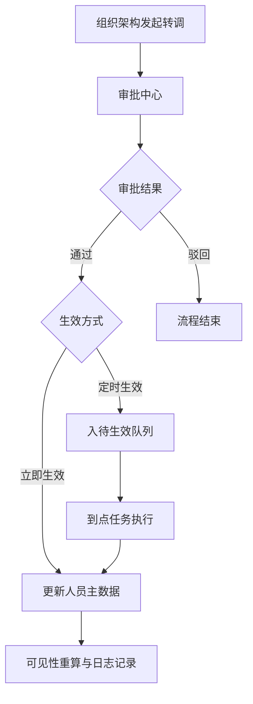

# 政务通讯录管理后台需求评审稿

> 本文档基于 `docs/gov-contacts-demo-prd-v1.md` 的功能点清单（106点）整理，结构遵循评审模板：开发计划 -> 需求分析 -> 交互描述 -> 非交互描述 -> 产品自查。

## 文档信息

| 项 | 内容 |
|---|---|
| 文档名称 | 政务通讯录管理后台需求评审稿 |
| 项目 | `gov-contacts-demo` |
| 版本 | v2.1 |
| 评审状态 | 待评审 |
| 产品负责人 | 待补充 |
| 技术负责人 | 待补充 |
| 测试负责人 | 待补充 |
| 计划评审时间 | 待补充 |

---

## 开发计划

### 1. 功能清单

> 说明：按最小可开发/测试/发布单元拆解，优先级与 `prd-v1` 保持一致。首页仅汇报，不计功能点。

| 需求名称（最小单元） | 对应功能点（来自PRD） | 点数 | 优先级 | 公私网是否一致 | 预期发布版本/时间 |
|---|---|---:|---|---|---|
| 组织架构与人员管理 | 组织树、人员 CRUD、任职、秘书关系、导入导出、批量操作 | 32 | P0/P1/P2 | 是 | v1.0 / 待定 |
| 审批中心（转调） | 审批处理、流程配置、队列查询、到点生效 | 12 | P1/P2 | 是（流程可配置） | v1.1 / 待定 |
| 外部人员管理 | 外部申请、审批、到期检查、状态记录 | 8 | P1/P2 | 是（策略可差异） | v1.1 / 待定 |
| 临时组织提醒 | 列表查询、提醒计算、提醒刷新、结果展示 | 4 | P1 | 是 | v1.1 / 待定 |
| 行政区划/条线/编码管理 | 区划树、条线树、节点 CRUD、导入导出、编码管理 | 20 | P0/P1/P2 | 是 | v1.0 / 待定 |
| 可见性配置与验证 | 默认/自定义/高级规则、验证、日志 | 14 | P0 | 是 | v1.0 / 待定 |
| 展示配置与移动端效果演示 | 展示规则、卡片分组、演示页 | 10 | P1/P2 | 基本一致 | v1.1 / 待定 |
| 自定义字段管理 | 字段 CRUD、必填与格式规则 | 6 | P1 | 是 | v1.1 / 待定 |
| **总计** |  | **106** |  |  |  |

### 2. 技术可行性验证

| 验证项 | 验证内容 | 负责人 | 当前结论 | 风险等级 |
|---|---|---|---|---|
| 审批状态机一致性 | 审批单、待生效队列、人员主数据三方一致性 | 待补充 | 待验证 | 中 |
| 规则引擎可解释性 | 可见性冲突规则优先级与命中解释 | 待补充 | 待验证 | 中 |
| 导入数据质量 | 预检准确率、失败回滚、错误定位 | 待补充 | 待验证 | 中 |
| 多端字段协议 | Web/Android/iOS/Harmony 字段口径一致 | 待补充 | 待验证 | 高 |
| 任务调度稳定性 | 定时生效任务可靠执行与补偿 | 待补充 | 待验证 | 高 |

### 3. 涉及业务

| 模块 | 是否涉及 | 涉及内容 | 业务对接人确认记录 |
|---|---|---|---|
| 管理后台 | 是 | 组织、权限、配置联动 | 待确认 |
| 多租户平台 | 是 | 租户隔离与规则作用域 | 待确认 |
| 系统后台 | 是 | 审批流与任务调度复用 | 待确认 |
| 开放接口 | 预留 | 组织/人员/规则查询能力 | 待确认 |
| 移动端 Android | 预留 | 字段展示协议兼容 | 待确认 |
| 移动端 iOS | 预留 | 字段展示协议兼容 | 待确认 |
| 安全与审计 | 是 | 操作日志、审计留痕 | 待确认 |
| 运维平台 | 是 | 任务失败重试、告警策略 | 待确认 |

### 4. 国际化适配要求

| 规则 | 勾选 | 备注 |
|---|---|---|
| 是否全球普适（非国家定制） | □ | 当前为中文政务场景 |
| 是否需要跨区互通 | □ | 暂无强制诉求 |
| 是否需要多语言 | □ | 预留 key 结构 |
| 是否涉及海外合规 | □ | 本期不涉及 |
| 是否存在域名/后端差异 | □ | 私有化可能差异 |
| 是否需要法务评估 | □ | 待法务确认 |

---

## 需求分析

### 1. 需求背景

| 场景 | 谁（对象/角色） | 想要什么（用户目标） | 当前问题（痛点） | 截图/附件 |
|---|---|---|---|---|
| 政务通讯录治理 | 平台管理员、组织管理员 | 高效维护组织/人员并保证可见性准确 | 数据分散、规则复杂、维护成本高 | 待补充 |
| 人员转调治理 | 管理员、审批人 | 流程化转调并按时生效 | 手工改数据风险高、状态不可追踪 | 待补充 |
| 外部协作接入 | 管理员、外部协作人 | 安全接入并可控到期 | 到期治理弱、权限边界不清晰 | 待补充 |

### 2. 需求等级

| S | A | B | 其他 |
|---|---|---|---|
| □ | □ | ☑ | □ |

### 3. 竞品分析

| 竞品 | 方案-中文 | 方案-英文 | 优势 | 劣势 |
|---|---|---|---|---|
| 蓝信 | 待补充 | 待补充 | 政务条线能力成熟 | 体验灵活性一般 |
| 专有钉钉 | 待补充 | 待补充 | 生态与流程能力强 | 高度定制成本高 |
| 企业微信政务版 | 待补充 | 待补充 | 连接能力强 | 深度政务能力需扩展 |
| 总结 |  |  | 本方案重点补齐组织+规则+流程闭环 | 需强化多端一致性与调度稳定性 |

### 4. 需求目标
- 目标1：核心治理链路闭环（组织维护 -> 审批 -> 生效 -> 规则重算）。
- 目标2：高频操作效率提升（导入导出、批量管理、规则验证）。
- 目标3：可观测性建立（事件埋点、流程指标、异常追踪）。

### 5. 成本和收益

| 维度 | 定义 | 评估点 |
|---|---|---|
| 成本 | 人力、研发、测试、运维、潜在资源成本 | 人天投入、改造范围、运维复杂度 |
| 收益 | 用户价值与业务价值 | 治理效率、错误率下降、交付质量、可复制性 |

---

## 描述内容1：交互描述（与界面强关联）

### 1. 流程图 / 框架图

### 2. 概念定义
- 主职：人员主任职信息，决定主部门展示与回填。
- 条线：跨组织业务维度。
- 可见性规则：控制查看、搜索、私聊等权限的规则集合。

### 3. 角色权限点

| 角色 | 页面访问 | 核心操作权限 |
|---|---|---|
| platform_admin | 全量 | 全量管理/审批/配置 |
| org_admin | 主要页面 | 组织范围管理与审批 |
| user | 限制页面 | 仅查看，管理按钮禁用 |

### 4. 交互说明（按功能点补充）

#### 4.1 功能点一：组织架构与人员管理（32点）
##### 4.1.1 交互界面图
- 当前UI：`[待补充截图/链接]`
- 目标UI：`[待补充截图/链接]`
##### 4.1.2 入口、权限及权益说明
- 入口：侧边菜单“组织架构”。
- 权限：管理员可全量操作，普通用户仅查看。
##### 4.1.3 页面及交互说明
- 组织树与成员表联动、筛选分页、批量操作、导入导出、转调入口、草稿恢复。
##### 4.1.4 边界影响
- 影响审批中心、可见性配置、展示配置的数据源口径。

#### 4.2 功能点二：可见性配置与验证（14点）
##### 4.2.1 交互界面图
- 当前UI：`[待补充截图/链接]`
- 目标UI：`[待补充截图/链接]`
##### 4.2.2 入口、权限及权益说明
- 入口：侧边菜单“可见性配置”。
- 权限：仅管理员可新增/编辑/删除规则与执行验证。
##### 4.2.3 页面及交互说明
- 规则分层（默认/自定义/高级）+ 验证输入（查看者/目标/场景）+ 结果解释。
##### 4.2.4 边界影响
- 直接影响通讯录显示、搜索命中、私聊入口。

#### 4.3 功能点三：区划与条线管理（20点）
##### 4.3.1 交互界面图
- 当前UI：`[待补充截图/链接]`
- 目标UI：`[待补充截图/链接]`
##### 4.3.2 入口、权限及权益说明
- 入口：区划管理、条线管理、条线通讯录管理。
- 权限：管理员可节点 CRUD 与导入导出。
##### 4.3.3 页面及交互说明
- 双 Tab 切换、树节点选中联动、节点维护、成员排序、编码管理。
##### 4.3.4 边界影响
- 影响部门绑定维度、规则作用域、展示筛选维度。

#### 4.4 功能点四：审批中心与转调链路（12点）
##### 4.4.1 交互界面图
- 当前UI：`[待补充截图/链接]`
- 目标UI：`[待补充截图/链接]`
##### 4.4.2 入口、权限及权益说明
- 入口：审批中心。
- 权限：管理员审批、配置流程、执行到点任务。
##### 4.4.3 页面及交互说明
- 审批通过/驳回、流程节点调整、队列查询、到点执行。
##### 4.4.4 边界影响
- 影响人员主数据、日志审计、可见性重算。

### 5. 深色模式适配
- 本期不做深色模式专项适配；后续可基于 token 化推进。

### 6. 多语言
- 本期中文，预留多语言 key 与资源文件结构。

### 7. 多平台适配
- 当前交付 Web；Android/iOS/Harmony 采用统一字段口径接入。

### 8. 虚拟身份适配
- 本期不纳入核心范围；后续评估对会话、权限、搜索、日志的影响。

---

## 描述内容2：非交互描述

### 1. 新旧兼容
- 本期新方案落地，需预留历史数据迁移策略与兼容检查点。

### 2. 套餐授权
- 当前不涉及特殊套餐差异；私有化场景按合同扩展。

### 3. 涉及配置
- 需支持流程配置、可见性配置、展示配置、自定义字段配置。

### 4. 功能形态
- 以标准功能为主，二开/插件化能力后续扩展。

### 5. 管理后台统一管控配置响应
- 需确认公私网策略差异对权限、规则上限的影响。

### 6. 能力开放
- 预留组织、人员、规则查询能力开放接口。

### 7. 二开拓展
- 支持客户化字段、流程节点、规则策略扩展。

### 8. 日志审计
- 关键日志覆盖：人员修改、规则变更、审批动作、任务执行。

### 9. 数据埋点

| 数据指标（示例） | 示意图 | 前端/服务端埋点 |
|---|---|---|
| 功能使用人数（UV） | 待补充 | 前端 + 服务端 |
| 功能使用次数（PV） | 待补充 | 前端 |
| 页面访问次数（PV） | 待补充 | 前端 |
| 转调提交率/通过率 | 待补充 | 服务端 |
| 规则验证成功率 | 待补充 | 服务端 |

### 10. 公私网表现差异
- 私有化场景可能在鉴权、流程配置上限、日志接入上存在差异。

### 11. 品牌化 & 权益定义
- 本期不做深度品牌化；如需企业 logo/名称/主题，需补配置项。

---

## 产品自查项

### 1. 交互自查项

| 检查项 | 设计自查 | 审核人1 | 审核人2 |
|---|---|---|---|
| 系统特性（版本/权限/兼容）明确 | □ | □ | □ |
| 功能差异（公私网、新旧版本）明确 | □ | □ | □ |
| 接口与失败重试逻辑明确 | □ | □ | □ |
| 用户权限与角色边界合理 | □ | □ | □ |
| 输入边界与错误提示完整 | □ | □ | □ |
| 数据存储与异常处理方案完整 | □ | □ | □ |
| 企业逻辑（禁用/删除/离职）一致 | □ | □ | □ |
| 交互设计（样式/引导/信息层级）合理 | □ | □ | □ |
| 埋点指标与采集口径明确 | □ | □ | □ |
| 三方依赖与风险边界明确 | □ | □ | □ |
| 界面适配（暗黑/多端/多语言）评估 | □ | □ | □ |
| AI能力（如涉及）提示与效果评估 | □ | □ | □ |

